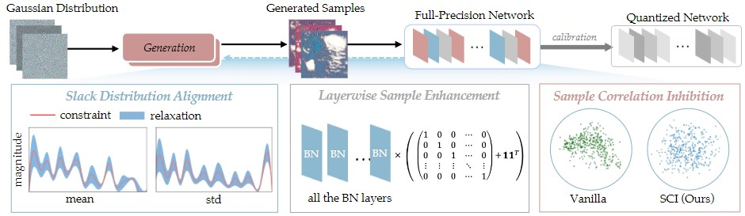
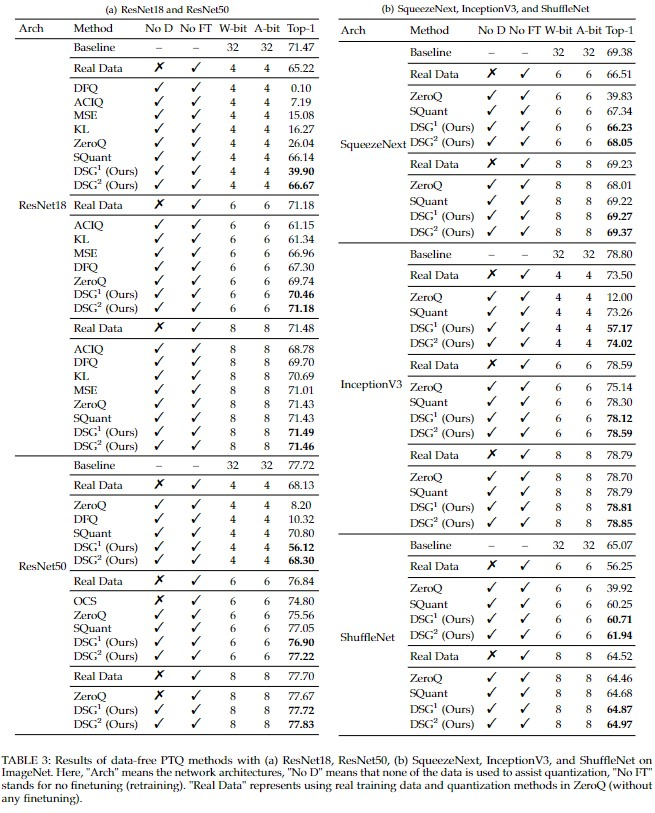
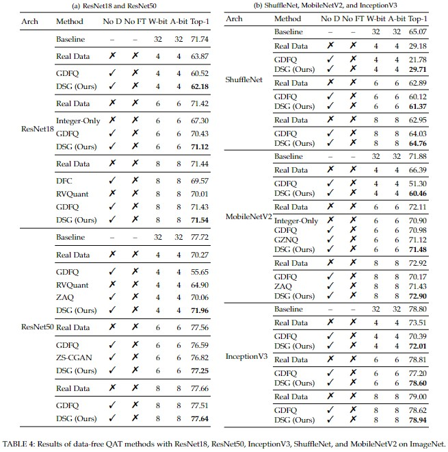

## ***Diverse Sample Generation: Pushing the Limit of Data-free Quantization***

Created by [Haotong Qin](https://htqin.github.io/), Yifu Ding, XiangguoZhang, Jiakai Wang, [Xianglong Liu](http://sites.nlsde.buaa.edu.cn/~xlliu/)*, and [Jiwen Lu](http://ivg.au.tsinghua.edu.cn/Jiwen_Lu/) from Beihang University and Tsinghua University.



### Introduction

Generative data-free quantization emerges as a practical compression approach that quantizes deep neural networks to low bit-width without accessing the real data. This approach generates data utilizing batch normalization (BN) statistics of the full-precision networks to quantize the networks. However, it always faces the serious challenges of accuracy degradation in practice. We first give a theoretical analysis that the diversity of synthetic samples is crucial for the data-free quantization, while in existing approaches, the synthetic data completely constrained by BN statistics experimentally exhibit severe homogenization at distribution and sample levels. This paper presents a generic ***Diverse Sample Generation (DSG)*** scheme for the generative data-free quantization, to mitigate detrimental homogenization. We first slack the statistics alignment for features in the BN layer to relax the distribution constraint. Then, we strengthen the loss impact of the specific BN layers for different samples and inhibit the correlation among samples in the generation process, to diversify samples from the statistical and spatial perspectives, respectively. Comprehensive experiments show that for large-scale image classification tasks, our DSG can consistently quantization performance on different neural architectures, especially under ultra-low bit-width. And data diversification caused by our DSG brings a general gain to various quantization-aware training and post-training quantization approaches, demonstrating its generality and effectiveness.

### Results

Here are the results of data-free quantization methods with various architectures on the ImageNet dataset.

**Data-free Post-training Quantization (PTQ) Methods**

 

**Data-free Quantization-aware Training (QAT) Methods**

 

### Citation

If you find our work useful in your research, please consider citing:

```
@misc{qin2021diverse,
      title={Diverse Sample Generation: Pushing the Limit of Generative Data-free Quantization}, 
      author={Haotong Qin and Yifu Ding and Xiangguo Zhang and Jiakai Wang and Xianglong Liu and Jiwen Lu},
      year={2021},
      eprint={2109.00212},
      archivePrefix={arXiv},
      primaryClass={cs.CV}
}
```
