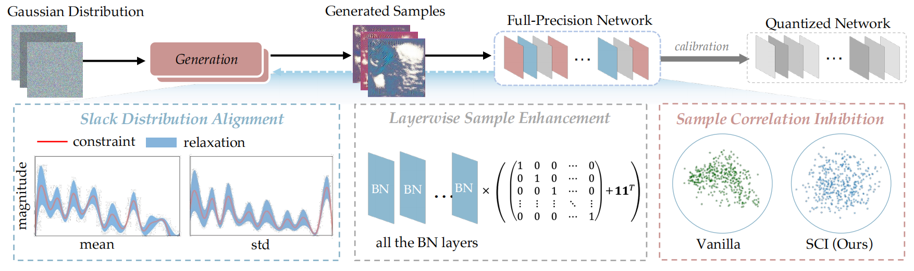

## ***Diverse Sample Generation: Pushing the Limit of Data-free Quantization***

Created by [Haotong Qin](https://htqin.github.io/), [Yifu Ding](https://yifu-ding.github.io/), XiangguoZhang, [Jiakai Wang](https://jiakaiwangcn.github.io/), [Xianglong Liu](http://sites.nlsde.buaa.edu.cn/~xlliu/)*, and [Jiwen Lu](http://ivg.au.tsinghua.edu.cn/Jiwen_Lu/) from Beihang University and Tsinghua University.



### 1 Introduction

Generative data-free quantization emerges as a practical compression approach that quantizes deep neural networks to low bit-width without accessing the real data. This approach generates data utilizing batch normalization (BN) statistics of the full-precision networks to quantize the networks. However, it always faces the serious challenges of accuracy degradation in practice. We first give a theoretical analysis that the diversity of synthetic samples is crucial for the data-free quantization, while in existing approaches, the synthetic data completely constrained by BN statistics experimentally exhibit severe homogenization at distribution and sample levels. This paper presents a generic ***Diverse Sample Generation (DSG)*** scheme for the generative data-free quantization, to mitigate detrimental homogenization. We first slack the statistics alignment for features in the BN layer to relax the distribution constraint. Then, we strengthen the loss impact of the specific BN layers for different samples and inhibit the correlation among samples in the generation process, to diversify samples from the statistical and spatial perspectives, respectively. Comprehensive experiments show that for large-scale image classification tasks, our DSG can consistently quantization performance on different neural architectures, especially under ultra-low bit-width. And data diversification caused by our DSG brings a general gain to various quantization-aware training and post-training quantization approaches, demonstrating its generality and effectiveness.

### 2 Dependencies

```shell
python==3.7
pytorch==1.2.0
torchvision==0.4.0
# other dependencies in requirements.txt
```

### 3 Getting Started

#### 3.1 Installation

(1) Clone this repo:

````shell
git clone git@github.com:yifu-ding/DSG.git
````

(2) Choose one quantization scheme:

````shell
cd DSG/dsg_qat  # if choosing QAT
cd DSG/dsg_ptq  # if choosing PTQ
````

(3) Install pytorch and other dependencies:

````shell
pip install -r requirements.txt
````

#### 3.2 Set the paths of datasets for testing

For Post-Training Quantization (PTQ):

Set the `data_path` in run script. For example:

```shell
data_path = "/path/to/imagenet/val"
```

For Quantization-Aware Training (QAT):

Set the `dataPath` in "imagenet_resnet.hocon" if using ImageNet dataset. For example:

```shell
dataPath = "/path/to/imagenet"
```

#### 3.3 Training

For PTQ:

````shell
python3 uniform_test.py [--dataset] [--data_path] [--model] [--batch_size] [--test_batch_size] [--w_bit] [--a_bit] 

optional arguments:
--dataset                   name of dataset (default: imagenet)
--data_path									path of dataset (default: /path/to/imagenet/val)
--model                     model to be quantized (default: resnet18)
--batch-size                batch size of distilled data (default: 64)
--test-batch-size           batch size of test data (default: 512)
--w_bit											bit-width of weight (default: 4)
--a_bit											bit-width of activation (default: 4)
````

For QAT:

````shell
python3 main.py [--conf_path] [--arc] [--id]

optional arguments:
--conf_path 					 			configure file path (default: imagenet_resnet.hocon)
--model				  						model to be quantized (default :resnet18)
--id 												experiment id (default: 0)
````

### 4 Results

The following are the results of our DSG. We also provide models quantized by DSG-PTQ for the lowest bit-width for all network architectures and their results for easy evaluation, where the $\textcolor{green}{\text{green}}$ value means the result outperforms that reported in the manuscript.

| Scheme      | Model       | Dataset  | FP32  | W4A4               | W6A6               | W8A8  |
| ----------- | ----------- | -------- | ----- | ------------------------------------ | ------------------------------------ | ----- |
| DSG-PTQ$^*$ | ResNet18    | ImageNet | 71.47 | 39.90 ${\textcolor{green}{(40.41)}}$ | 70.46                                | 71.49 |
|             | ResNet50    | ImageNet | 77.72 | 56.12 ${\textcolor{green}{(56.36)}}$ | 76.90                                | 77.72 |
|             | InceptionV3 | ImageNet | 78.80 | 57.17 ${\textcolor{green}{(59.58)}}$ | 78.12                                | 78.81 |
|             | SqueezeNext | ImageNet | 69.38 | -                                    | 66.23 ${{(66.23)}}$                  | 69.27 |
|             | ShuffleNet  | ImageNet | 65.07 | -                                    | 60.71 ${\textcolor{green}{(60.85)}}$ | 64.87 |
| DSG-QAT     | ResNet18    | ImageNet | 71.47 | 62.18                                | 71.12                                | 71.54 |
|             | ResNet50    | ImageNet | 77.72 | 71.96                                | 77.25                                | 77.64 |
|             | ShuffleNet  | ImageNet | 65.07 | 29.71                                | 61.37                                | 64.76 |
|             | MobileNetV2 | ImageNet | 71.88 | 60.46                                | 71.48                                | 72.90 |
|             | InceptionV3 | ImageNet | 78.80 | 72.01                                | 78.60                                | 78.94 |

* DSG-PTQ denotes DSG-PTQ$^1$ in manuscript

### 5 Acknowledgement

The original code is borrowed from [ZeroQ](https://github.com/amirgholami/ZeroQ) and [GDFQ](https://github.com/xushoukai/GDFQ).

### 6 Citation

If this work is useful for your research, please cite our paper:

```shell
@article{qin2021diverse,
  title={Diverse Sample Generation: Pushing the Limit of Generative Data-free Quantization},
  author={Qin, Haotong and Ding, Yifu and Zhang, Xiangguo and Wang, Jiakai and Liu, Xianglong and Lu, Jiwen},
  journal={arXiv preprint arXiv:2109.00212},
  year={2021}
}
```


